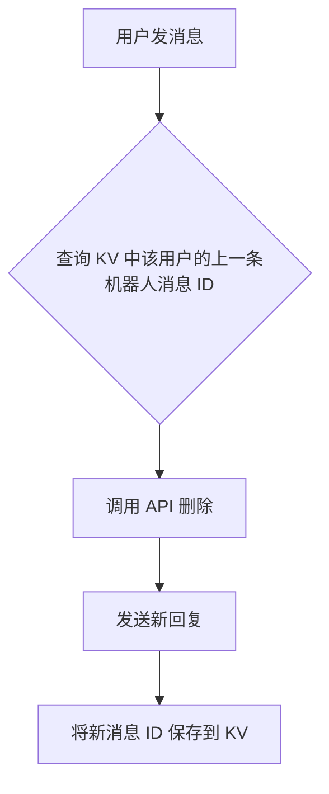
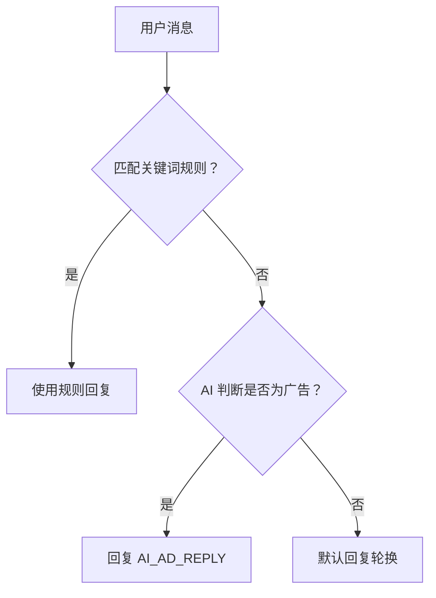

# TGDM - Telegram 私聊机器人

[](https://workers.cloudflare.com/)
[](LICENSE)

TGDM 是一个功能完备的 Telegram 私聊机器人，支持**自定义标签格式**、**关键词匹配**、**AI 广告检测（Workers AI）**、**媒体回复**、**内联按钮**、**冷却时间**等核心功能。

## 部署方式

TGDM 提供两种基于 Cloudflare Workers 的部署方案，以适应不同需求：

*   **无 KV 版**：轻量快速，无需绑定存储，适合大多数场景。
*   **有 KV 版**：额外支持**删除上一条回复**（`KEEP_LAST_ONLY`），保持聊天界面整洁。

> AI 广告检测是可选功能，可在这两种部署中任意开启。

## 目录

- [功能特性](#-功能特性)
- [文件结构](#-文件结构)
- [Cloudflare Workers 版部署（无 KV）](#-cloudflare-workers-版部署无-kv)
- [Cloudflare Workers 版部署（有 KV）](#-cloudflare-workers-版部署有-kv)
- [AI 广告检测配置](#-ai-广告检测配置)
- [自定义标签语法](#-自定义标签语法)
- [转义规则（重要）](#-转义规则重要)
- [内联按钮](#-内联按钮)
- [媒体回复](#-媒体回复)
- [规则优先级与冷却时间](#-规则优先级与冷却时间)
- [常见问题](#-常见问题)
- [许可证](#-许可证)

## ✨ 功能特性

| 功能特性                     | 无 KV | 有 KV |
| :--------------------------- | :---: | :---: |
| 自动回复（关键词+默认）      |  ✅   |  ✅   |
| 自定义标签转 HTML            |  ✅   |  ✅   |
| 毫秒级延迟响应               |  ✅   |  ✅   |
| 黑名单功能                   |  ✅   |  ✅   |
| Business 账号支持            |  ✅   |  ✅   |
| 内联按钮（URL）              |  ✅   |  ✅   |
| 媒体回复（图片/视频/文件等） |  ✅   |  ✅   |
| Premium Emoji 发送           |  ✅   |  ✅   |
| "正在输入"状态               |  ✅   |  ✅   |
| 用户冷却时间                 |  ✅   |  ✅   |
| 规则优先级                   |  ✅   |  ✅   |
| 全消息类型响应               |  ✅   |  ✅   |
| **删除上一条回复**           |  ❌   |  ✅   |
| **Workers AI 广告检测**      | ✅ (可选) | ✅ (可选) |

## 📁 文件结构

```
tgdm/
├── worker.js            # 无 KV 版
├── worker-kv.js         # 有 KV 版
├── LICENSE
└── README.md
```

## ☁️ Cloudflare Workers 版部署（无 KV）

### 1. 获取 Bot Token

通过 [@BotFather](https://t.me/BotFather) 创建机器人，获取 `TG_TOKEN`。

### 2. 创建 Worker

1.  登录 [Cloudflare 仪表板](https://dash.cloudflare.com/) → **Workers & Pages** → **创建 Worker**。
2.  将 `worker.js` 代码复制到编辑器中，点击**部署**。

### 3. 配置环境变量

进入 Worker 的 **设置 → 变量**：

**密钥类型（Secret）：**

| 变量名           | 说明             |
| :--------------- | :--------------- |
| `TG_TOKEN`       | 机器人 Token     |
| `ADMIN_TOKEN`    | 管理端点鉴权 Token |
| `WEBHOOK_SECRET` | Webhook 安全校验 Token（可选） |

**纯文本类型（Plain text）：**

| 变量名                     | 默认值                           | 说明                 |
| :------------------------- | :------------------------------- | :------------------- |
| `BOT_ENABLED`              | `true`                           | 总开关               |
| `OWNER_ID`                 | 空                               | 管理员 ID（数字）    |
| `IGNORE_OWNER`             | `true`                           | 忽略管理员消息       |
| `REPLY_MODE`               | `true`                           | 引用回复             |
| `DELAY_ENABLED`            | `true`                           | 延迟开关             |
| `DELAY_MIN`                | `50`                             | 最小延迟（毫秒）     |
| `DELAY_MAX`                | `100`                            | 最大延迟（毫秒）     |
| `TYPING_ENABLED`           | `false`                          | 显示"正在输入"       |
| `COOLDOWN_ENABLED`         | `false`                          | 冷却开关             |
| `COOLDOWN_SECONDS`         | `30`                             | 冷却秒数             |
| `AI_ENABLED`               | `false`                          | AI 检测开关          |
| `AI_AD_REPLY`              | 见下文                           | AI 判定广告时的回复  |
| `AI_MODEL`                 | `@cf/meta/llama-3.1-8b-instruct` | AI 模型              |

**JSON 类型：**

*   **`DEFAULT_REPLY`**（数组或字符串）：

    ```json
    [
      "<jh>[AutoReply]</jh></n></n><yy>你好，有什么可以帮助你的吗？</yy>",
      "<jh>[AutoReply]</jh></n></n><yy>请稍等，我会尽快回复你的。</yy>"
    ]
    ```

*   **`RULES`**（对象数组，**注意 JSON 字符串内双引号需要转义**）：

    ```json
    [
      {
        "keywords": ["广告", "推广"],
        "reply": "<yy><jd><xt>广告勿扰😅</xt></jd></yy>",
        "priority": 10
      },
      {
        "keywords": ["你好", "您好"],
        "reply": "<jh>[AutoReply]</jh> 你好！<yy>自述：<lj url=\"https://example.com\">详情</lj></yy>",
        "buttons": [[{"text":"🌐 网站","url":"https://example.com"}]],
        "priority": 5
      }
    ]
    ```

*   **`BLACKLIST`**（数字数组）：

    ```json
    [123456789]
    ```

### 4. 设置 Webhook

访问：`https://你的worker域名/setup?token=你的ADMIN_TOKEN`

### 5. 测试

向机器人发送消息，检查回复。

### 调试端点

| 路径              | 功能           |
| :---------------- | :------------- |
| `/`               | 健康检查       |
| `/setup`          | 设置 Webhook   |
| `/webhook-info`   | 查看 Webhook 状态 |
| `/config`         | 查看配置摘要   |
| `/test-ai`        | 测试 AI 检测   |
| `/delete-webhook` | 删除 Webhook   |
| `/delete-message` | 手动删除消息   |

## 💾 Cloudflare Workers 版部署（有 KV）

### 新增步骤

1.  **创建 KV 命名空间**：Workers & Pages → KV → 创建，命名为 `tgdm`。
2.  **绑定到 Worker**：设置 → 绑定 → 添加 KV 命名空间，变量名 `LAST_REPLY_KV`。
3.  **添加环境变量**：`KEEP_LAST_ONLY = true`。
4.  使用 `worker-kv.js` 代码。

### 工作原理



每个用户独立存储，数据保留 48 小时。

## 🤖 AI 广告检测配置

启用后，机器人会先匹配关键词规则，未匹配时调用 Workers AI 判断消息是否属于广告/黑灰产。

### 开启步骤

1.  **添加 AI 绑定**：Worker → 设置 → 绑定 → 添加 **AI**，变量名 `AI`。
2.  **设置环境变量**：
    *   `AI_ENABLED = true`
    *   `AI_AD_REPLY = <yy><jd><xt>广告滚开</xt></jd></yy> 😅`
    *   （可选）`AI_MODEL = @cf/meta/llama-3.1-8b-instruct`
3.  **重新部署**。

### 优先级逻辑



### 测试 AI

访问：`https://你的worker域名/test-ai?token=你的ADMIN_TOKEN&text=免费领iPhone`

返回示例：

```json
{
  "is_ad": true,
  "text": "免费领iPhone",
  "latency_ms": 350
}
```

### 注意事项

*   免费额度：Workers AI 每日 10k Neurons，单次判断约消耗 0.3 Neurons。
*   无需 API Key：完全 Cloudflare 原生。
*   纯文本兜底：若不设置 `AI_AD_REPLY`，默认使用 `[AutoReply] 您的消息被识别为广告或推广内容，已被过滤。`。
*   关闭 AI：删除 `AI_ENABLED` 或设为 `false` 即可。

## 🏷️ 自定义标签语法

| 标签                               | 功能         | 示例                                     |
| :--------------------------------- | :----------- | :--------------------------------------- |
| `<yy>text</yy>`                    | 引用块       | `<yy>引用内容</yy>`                     |
| `<yyzd>text</yyzd>`                | 可折叠引用   | `<yyzd>详细说明</yyzd>`                 |
| `<dk>text</dk>`                    | 行内代码     | `<dk>const a = 1</dk>`                  |
| `<jd>text</jd>`                    | 加粗         | `<jd>重要</jd>`                         |
| `<xt>text</xt>`                    | 斜体         | `<xt>强调</xt>`                         |
| `<sc>text</sc>`                    | 删除线       | `<sc>旧内容</sc>`                       |
| `<xh>text</xh>`                    | 下划线       | `<xh>重点</xh>`                         |
| `<js>text</js>`                    | 代码块       | `<js>def f(): pass</js>`                |
| `<jh>text</jh>`                    | 剧透         | `<jh>猜猜看</jh>`                       |
| `<lj url="URL">text</lj>`        | 超链接       | `<lj url="https://example.com">链接</lj>`  |
| `<tj>user_id</tj>`                | 提及用户     | `<tj>123456789</tj>`                   |
| `<em id="数字ID">fallback</em>` | Premium Emoji | `<em id="6323518884347381156">👋</em>`|
| `</n>`                             | 换行         | `第一行</n>第二行`                       |

嵌套规则：`<jd>`、`<xt>`、`<xh>`、`<sc>`、`<jh>` 可互相嵌套；`<yy>` 内可含上述标签；`<dk>`、`<js>`、`<yy>` 内不能再嵌套 `<yy>`。

## ⚠️ 转义规则（重要）

根据配置位置的不同，转义要求完全不同：

| 配置位置                   | 格式               | 转义要求                                     | 正确示例                                                                  |
| :------------------------- | :----------------- | :------------------------------------------- | :------------------------------------------------------------------------ |
| `AI_AD_REPLY` 环境变量     | 纯文本             | 不要任何转义                                 | `<em id="123">😅</em>` ✅ <br> `<em id=\"123\">😅</em>` ❌ |
| `DEFAULT_REPLY` / `RULES` 内的字符串 | JSON 字符串        | 双引号转义为 `\"`                           | `"<lj url=\"https://example.com\">链接</lj>"` |

注意：URL 中不会出现反斜杠，只需转义包裹 URL 的双引号即可。例如：`<lj url="https://example.com?id=1">` 在 JSON 中写成 `"<lj url=\"https://example.com?id=1\">"`。

常见错误：

*   ❌ 在 `AI_AD_REPLY` 中写 `\"` 导致发送失败。
*   ❌ 在 `RULES` 的 JSON 中忘记转义双引号，导致 JSON 解析失败。

## 🔘 内联按钮

在 `RULES` 中添加 `buttons` 字段（二维数组）：

```json
{
  "keywords": ["联系"],
  "reply": "请通过以下方式联系：",
  "buttons": [
    [{"text": "📧 邮件", "url": "mailto:hi@example.com"}],
    [{"text": "💬 Telegram", "url": "https://t.me/username"}]
  ]
}
```

## 🖼️ 媒体回复

支持的 `type`：`photo`、`video`、`audio`、`document`、`animation`。

```json
{
  "keywords": ["图片"],
  "reply": "送你一张图",
  "media": {
    "type": "photo",
    "url": "https://example.com/image.jpg"
  }
}
```

## ⚡ 规则优先级与冷却时间

*   **优先级**：`priority` 数值越高越优先（默认 `0`）。
*   **冷却**：`COOLDOWN_ENABLED=true` 时，同一用户在 `COOLDOWN_SECONDS` 秒内只回复一次（内存存储，重启重置）。

## ❓ 常见问题

<details>
<summary><b>机器人没有反应？</b></summary>

检查 `TG_TOKEN`、`BOT_ENABLED`，访问 `/webhook-info?token=ADMIN_TOKEN` 查看 Webhook 状态。

</details>

<details>
<summary><b>如何获取用户 ID？</b></summary>

查看 Worker 日志，或临时在回复中加 `<tj>ID</tj>` 让机器人发出来。

</details>

<details>
<summary><b>为什么 AI_AD_REPLY 中的标签发送失败？</b></summary>

`AI_AD_REPLY` 是纯文本，不要写 `\"`。正确：`<em id="123">😅</em>`。

</details>

<details>
<summary><b>RULES 中的双引号怎么处理？</b></summary>

转义为 `\"`，例如：`"<lj url=\"https://example.com\">链接</lj>"`。

</details>

<details>
<summary><b>需要付费吗？</b></summary>

Cloudflare Workers 免费额度：10 万请求/天；KV 免费 10 万读/1000 写/天；Workers AI 免费 10k Neurons/天。个人使用完全足够。

</details>

## 📄 许可证

[MIT License](LICENSE)

