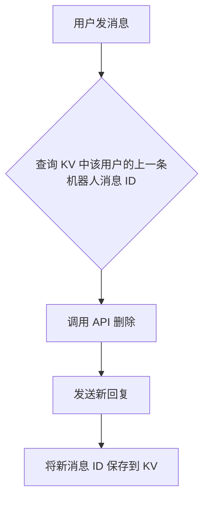
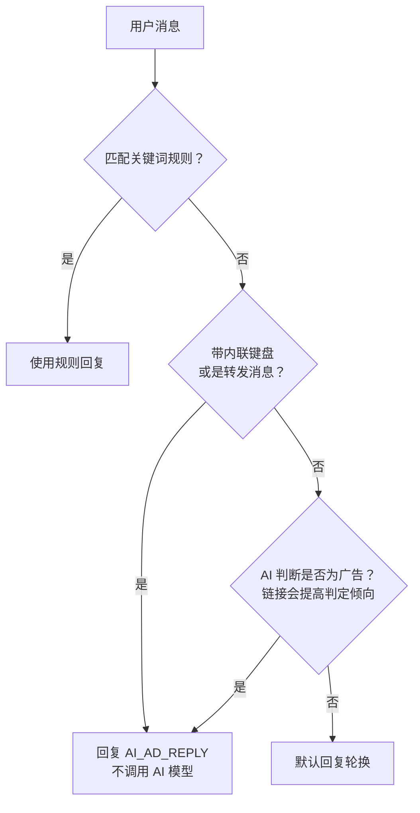

# TGDM - Telegram 私聊机器人

[](https://workers.cloudflare.com/)
[](LICENSE)

TGDM 是一个功能完备的 Telegram 私聊机器人，支持**自定义标签格式**、**关键词匹配**、**AI 广告检测（Workers AI）**、**媒体回复**、**内联按钮**、**冷却时间**等核心功能。

## 部署方式

TGDM 提供两种基于 Cloudflare Workers 的部署方案，以适应不同需求：

*   **无 KV 版**：轻量快速，无需绑定存储，适合大多数场景。
*   **有 KV 版**：额外支持**删除上一条回复**（`KEEP_LAST_ONLY`），保持聊天界面整洁。

> AI 广告检测是可选功能，可在这两种部署中任意开启。

**完全免费**：Cloudflare Workers 免费额度对个人使用足够，无需付费、无需服务器、无需域名。

## 📥 获取代码

前往 [Releases 页面](https://github.com/xiaomuahua666/TelegramDirectmessageManager/releases) 下载：

| 下载文件          | 说明 |
| :---------------- | :--- |
| `worker-withoutKV.zip` | 无 KV 版，解压后得到 `worker.js` |
| `worker-withKV.zip`    | 有 KV 版，解压后得到 `worker.js` |

解压后你会得到一个 `worker.js` 文件，**它的全部内容就是你要粘贴到 Cloudflare 的东西**。

不确定选哪个？选 `worker-withoutKV.zip`。有 KV 版多了「自动删除上一条回复」的功能，会额外消耗 KV 存储额度。

## 📑 名词表

第一次读可能会遇到这些词，先扫一遍：

| 词 | 通俗解释 |
| :--- | :--- |
| **Bot Token** | 机器人的身份证。机器人对外的所有操作都靠它证明身份，泄露等于账号被盗 |
| **Webhook** | 「有事发生时 Telegram 主动来敲你的门」的机制。机器人不用一直轮询，Telegram 有新消息就 POST 到你的网址 |
| **Worker** | Cloudflare 提供的云端代码运行环境。相当于免费的服务器，代码上传上去就能通过网址访问 |
| **环境变量 / 变量** | 存在 Worker 里的配置项（如 Token、开关）。相当于给程序的设置项，不用改代码 |
| **Secret（密钥类型）** | 环境变量的一种，值会被加密存储、不在界面上明文显示。Token 类的东西必须用这种 |
| **KV** | Cloudflare 的键值数据库。Worker 联网后可读取，用来存少量数据（如「上次回复的消息 ID」） |
| **Neuron** | Workers AI 的计费单位。免费额度每日 1 万，单次广告判定约消耗 0.3 |
| **Workers AI** | Cloudflare 内置的 AI 服务，无需申请 API Key，直接绑定即可调用 |

## 📖 本文档怎么读

建议**按顺序读，不要跳**：

| 你的目标 | 读哪些 |
| :--- | :--- |
| 从零部署一个能用的机器人 | [功能特性](#-功能特性) → [获取代码](#-获取代码) → [部署](#-cloudflare-workers-版部署无-kv) |
| 让机器人按关键词回复指定内容 | 上面读完 → [完整 RULES 示例](#-完整-rules-示例) |
| 加广告识别 | 上面读完 → [AI 广告检测配置](#-ai-广告检测配置) |
| 回复想带图/视频/按钮 | 上面读完 → [媒体回复](#-媒体回复) → [内联按钮](#-内联按钮) |
| 机器人不回复 / 报错 | 直接跳到 [常见问题](#-常见问题) |
| 只是想改文案、换语气 | [完整 RULES 示例](#-完整-rules-示例) → [自定义标签语法](#-自定义标签语法) |

## 目录

- [名词表](#-名词表)
- [本文档怎么读](#-本文档怎么读)
- [功能特性](#-功能特性)
- [获取代码](#-获取代码)
- [文件结构](#-文件结构)
- [Cloudflare Workers 版部署（无 KV）](#-cloudflare-workers-版部署无-kv)
- [Cloudflare Workers 版部署（有 KV）](#-cloudflare-workers-版部署有-kv)
- [AI 广告检测配置](#-ai-广告检测配置)
- [自定义标签语法](#-自定义标签语法)
- [转义规则（重要）](#-转义规则重要)
- [内联按钮](#-内联按钮)
- [媒体回复](#-媒体回复)
- [完整 RULES 示例](#-完整-rules-示例)
- [三个都叫 "reply" 的东西，别搞混](#-三个都叫-reply-的东西别搞混)
- [规则优先级与冷却时间](#-规则优先级与冷却时间)
- [机器人如何读取你的消息](#-机器人如何读取你的消息)
- [远端配置说明](#-远端配置说明)
- [常见问题](#-常见问题)
- [许可证](#-许可证)

## ✨ 功能特性

| 功能特性                     | 无 KV | 有 KV |
| :--------------------------- | :---: | :---: |
| 自动回复（关键词+默认）      |  ✅   |  ✅   |
| 自定义标签转 HTML            |  ✅   |  ✅   |
| 毫秒级延迟响应               |  ✅   |  ✅   |
| 黑名单功能                   |  ✅   |  ✅   |
| Business 账号支持            |  ✅   |  ✅   |
| 内联按钮（URL）              |  ✅   |  ✅   |
| 媒体回复（图片/视频/文件等） |  ✅   |  ✅   |
| Premium Emoji 发送           |  ✅   |  ✅   |
| "正在输入"状态               |  ✅   |  ✅   |
| 用户冷却时间                 |  ✅   |  ✅   |
| 规则优先级                   |  ✅   |  ✅   |
| 全消息类型响应               |  ✅   |  ✅   |
| **删除上一条回复**           |  ❌   |  ✅   |
| **转发消息识别**            |  ✅   |  ✅   |
| **内联键盘识别**            |  ✅   |  ✅   |
| **Workers AI 广告检测**      | ✅ (可选) | ✅ (可选) |

## 📁 文件结构

仓库内的源码结构（供开发者参考，普通用户从 Releases 下载即可）：

```
TelegramDirectmessageManager/
├── wkoutKV/worker.js    # 无 KV 版
├── wkwithKV/worker.js   # 有 KV 版
├── LICENSE
└── README.md
```

Releases 里的 zip 解压后只含一个 `worker.js`，**把它的全部内容粘贴到 Cloudflare 编辑器**即可，无需关心目录结构。

## ☁️ Cloudflare Workers 版部署（无 KV）

### 1. 获取 Bot Token

通过 [@BotFather](https://t.me/BotFather) 创建机器人，获取 `TG_TOKEN`。

### 2. 创建 Worker

1.  登录 [Cloudflare 仪表板](https://dash.cloudflare.com/) → **Workers & Pages** → **创建 Worker**。
2.  将 `worker.js` 代码复制到编辑器中，点击**部署**。

### 3. 配置环境变量

进入 Worker 的 **设置 → 变量和机密**：

**密钥类型（Secret）—— 必填的三项**

| 变量名           | 说明 | 怎么填 |
| :--------------- | :--- | :----- |
| `TG_TOKEN`       | 机器人 Token | [@BotFather](https://t.me/BotFather) 创建后给你的那串，形如 `1234567890:AAH...` |
| `ADMIN_TOKEN`    | 管理端点密码 | 自己编一串随机字符，例如 `my-secret-9x2k`。**不填的话所有管理端点都打不开** |
| `WEBHOOK_SECRET` | Webhook 校验（可选） | 也自己编一串，**只能字母数字和 `_` `-`** |

添加方式：点**添加变量** → 下拉框选 **Secret** → 填名字和值 → 类型保持 **Text** → 保存。

**纯文本类型（Plain text）—— 全部有默认值，一个不填也能跑**

| 变量名                     | 默认值                           | 说明                 |
| :------------------------- | :------------------------------- | :------------------- |
| `BOT_ENABLED`              | `true`                           | 总开关。设`false` 机器人完全不工作 |
| `OWNER_ID`                 | 空| 你的 Telegram 数字 ID，机器人不会回复你 |
| `IGNORE_OWNER`             | `true`                           | 是否忽略管理员 |
| `REPLY_MODE`               | `true`                           | 见 [三个 reply](#-三个都叫-reply-的东西别搞混) |
| `DELAY_ENABLED`            | `true`                           | 延迟开关，模拟真人打字速度 |
| `DELAY_MIN`                | `50`                             | 最小延迟（毫秒）     |
| `DELAY_MAX`                | `100`                            | 最大延迟（毫秒）     |
| `TYPING_ENABLED`           | `false`                          | 显示"正在输入..."，建议开 |
| `COOLDOWN_ENABLED`         | `false`                          | 冷却开关，防止刷屏 |
| `COOLDOWN_SECONDS`         | `30`                             | 冷却秒数             |
| `AI_ENABLED`               | `false`                          | AI 广告检测开关，见 [AI 配置](#-ai-广告检测配置) |
| `AI_AD_REPLY`              | 见下文| 判定为广告时回复的内容 |
| `AI_MODEL`                 | `@cf/meta/llama-3.1-8b-instruct-fp8-fast` | AI 模型，一般不用改 |

> 💡 **布尔值只认 `true` 和 `false`**（不分大小写）。填 `1`、`yes`、`on` 都会被当作 `false`。这是个容易踩的坑。
>
> **最小配置**：只填 `TG_TOKEN` 和 `ADMIN_TOKEN` 就能跑起来了，其余全部有默认值。

**JSON 类型：**

*   **`DEFAULT_REPLY`**（数组或字符串）：

    ```json
    [
      "<jh>[AutoReply]</jh></n></n><yy>你好，有什么可以帮助你的吗？</yy>",
      "<jh>[AutoReply]</jh></n></n><yy>请稍等，我会尽快回复你的。</yy>"
    ]
    ```

*   **`RULES`**（对象数组，**注意 JSON 字符串内双引号需要转义**）：

    ```json
    [
      {
        "keywords": ["广告", "推广"],
        "reply": "<yy><jd><xt>广告勿扰😅</xt></jd></yy>",
        "priority": 10
      },
      {
        "keywords": ["你好", "您好"],
        "reply": "<jh>[AutoReply]</jh> 你好！<yy>自述：<lj url=\"https://example.com\">详情</lj></yy>",
        "buttons": [[{"text":"🌐 网站","url":"https://example.com"}]],
        "priority": 5
      }
    ]
    ```

*   **`BLACKLIST`**（数字数组）：

    ```json
    [123456789]
    ```

### 4. 设置 Webhook

访问：`https://你的worker域名/setup?token=你的ADMIN_TOKEN`

### 5. 测试

向机器人发送消息，检查回复。

### 关于 `WEBHOOK_SECRET`（可选但推荐）

它是一道门锁：Telegram 每次投递 Update 时都会在 `X-Telegram-Bot-Api-Secret-Token` 请求头里带上这个值，Worker 会校验它。用来防止别人拿到你的 Worker 域名后伪造 Update，骗你的机器人替他发消息、白耗你的 Workers AI 额度。

**不设置也能正常运行** —— 未设置时代码完全跳过校验，日常收发消息行为与设置时完全一致，所以设置后短期内看不出区别。

字符限制：**只能包含 `A-Z`、`a-z`、`0-9`、`_`、`-`**，长度 1-256。含中文或 `+`、`/`、`.` 等字符会被 `setWebhook` 拒绝。

> ⚠️ **修改 `WEBHOOK_SECRET` 后必须重新访问一次 `/setup`**。否则 Telegram 仍按旧值发头、Worker 按新值校验，所有请求返回 403，机器人彻底不回消息，且现象容易被误判为其他故障。正确顺序：改环境变量 → 重新部署 → 访问 `/setup?token=你的ADMIN_TOKEN`。

> ⚠️ **`ADMIN_TOKEN` 必须设置**。它未设置时所有管理端点一律返回 403（fail-closed 设计），此时你连 `/setup` 都访问不了。

关于 `ADMIN_TOKEN` 的鉴权方式，二选一即可：

```bash
# 方式一：URL 查询参数（方便浏览器直接打开）
https://你的worker域名/setup?token=你的ADMIN_TOKEN

# 方式二：Bearer Token
curl -H "Authorization: Bearer 你的ADMIN_TOKEN" https://你的worker域名/setup
```

### 调试端点

部署完可以用浏览器直接访问这些地址排查问题（在 URL 后面加 `?token=你的ADMIN_TOKEN`）：

| 路径              | 用途           | 正常返回 |
| :---------------- | :------------- | :------- |
| `/`               | 健康检查，确认 Worker 活着 | `TGDM Bot Worker is running` |
| `/setup`          | 告诉 Telegram 把消息发到这个地址 | `{"ok": true, ...}` |
| `/webhook-info`   | 查看 Telegram 那边是否正常 | 含 `pending_update_count`、`last_error_message` |
| `/config`         | 查看配置是否被正确读取 | 一堆配置项的 JSON |
| `/test-ai`        | 测试 AI 广告检测 | `{"is_ad": true/false, ...}` |
| `/delete-webhook` | 删除 Webhook（调试用） | `{"ok": true}` |
| `/delete-message` | 手动删除某条消息 | `{"ok": true}` |

**排查顺序**（机器人不回消息时按这个顺序走）：

```bash
# 1. Worker 活着吗？
curl https://你的域名/
# 期望：TGDM Bot Worker is running

# 2. 配置读到了吗？（这一条能单独验证 Worker 本身没问题）
curl "https://你的域名/config?token=你的ADMIN_TOKEN"
# 期望：一段 JSON

# 3. Telegram 那边正常吗？
curl "https://你的域名/webhook-info?token=你的ADMIN_TOKEN"
# 看 pending_update_count 是否有堆积、last_error_message 是否有报错

# 4. 以上都正常 → 直接给机器人发消息测试
```

| 现象 | 可能原因 |
| :--- | :--- |
| `/config` 返回 403 | `ADMIN_TOKEN` 没填或填错 |
| `/config` 返回 500 或非 JSON | Worker 代码或配置有问题，去看 Cloudflare 实时日志 |
| `pending_update_count` 持续增长 | Telegram 送不到你的地址，看 `last_error_message` |
| `last_error_message` 含 403 | `WEBHOOK_SECRET` 改动后没重跑 `/setup` |

## 💾 Cloudflare Workers 版部署（有 KV）

相比无 KV 版，多做四步。**如果你只是想有个机器人自动回复，用无 KV 版就够了**，不需要往下看。

### 新增步骤

1.  **创建 KV 命名空间**：左侧导航 **KV** → **Create Instance** → 命名 `tgdm` → 创建。
2.  **绑定到 Worker**：回到你的 Worker → **设置** → **绑定** → **添加** → 选 **KV Namespace** → 变量名填 `LAST_REPLY_KV` → 选择刚建的 `tgdm` → 保存。
3.  **添加环境变量**：`KEEP_LAST_ONLY` = `true`（纯文本）。
4.  **使用 `worker-withKV.zip` 里的代码**替换编辑器中的内容，重新部署。

### 工作原理


```mermaid
graph TD
    A[用户发消息] --> B{查询 KV 中该用户的上一条机器人消息 ID}
    B --> C[调用 API 删除]
    C --> D[发送新回复]
    D --> E[将新消息 ID 保存到 KV]
```

每个用户独立存储，数据保留 48 小时（与 Telegram 自身的消息删除时限一致）。

> 旧回复在**发送新回复之前**被删除。因此若新回复发送失败，该用户此处可能一条回复都不剩。
>
> Business 账号场景下的删除需要相应权限（`can_delete_sent_messages` 或 `can_delete_all_messages`）。权限不足时删除会失败，仅在日志中记录 `WARN`，消息不会被清理。

## 🤖 AI 广告检测配置

广告判定共三道防线，**前两道不需要 AI**：

1. **带内联键盘的消息** → 立即判定为广告（用户无法自行发按钮，必为转发广告）
2. **转发消息** → 立即判定为广告
3. **Workers AI 判定**（可选）→ 前两道都没命中时才调用，用来识别文字形式的广告

配置 Workers AI 后，机器人会先匹配关键词规则，未命中时判断是否为转发或带按钮，都没有才调用模型判断是否属于广告/黑灰产。链接与隐藏链接会作为额外线索告知模型。

### 开启步骤

1.  **添加 AI 绑定**：Worker → 设置 → 绑定 → 添加 **AI**，变量名 `AI`。
2.  **设置环境变量**：
    *   `AI_ENABLED = true`
    *   `AI_AD_REPLY = <yy><jd><xt>广告滚开</xt></jd></yy> 😅`
    *   （可选）`AI_MODEL = @cf/meta/llama-3.1-8b-instruct-fp8-fast`
3.  **重新部署**。

### 优先级逻辑


```mermaid
graph TD
    A[用户消息] --> B{匹配关键词规则？}
    B -- 是 --> C[使用规则回复]
    B -- 否 --> D{带内联键盘<br/>或是转发消息？}
    D -- 是 --> E[回复 AI_AD_REPLY<br/>不调用 AI 模型]
    D -- 否 --> F{AI 判断是否为广告？<br/>链接会提高判定倾向}
    F -- 是 --> E
    F -- 否 --> G[默认回复轮换]
```

> ⚠️ **关键词规则的优先级高于广告检测。** 若 `RULES` 里配了宽泛的关键词，广告消息会先被规则接走，不会走到广告判定。配置时请避免关键词过于宽泛（例如 `["的"]`）。

### 测试 AI

访问：`https://你的worker域名/test-ai?token=你的ADMIN_TOKEN&text=免费领iPhone`

返回示例：

```json
{
  "is_ad": true,
  "text": "免费领iPhone",
  "latency_ms": 350
}
```

### 注意事项

*   免费额度：Workers AI 每日 10k Neurons，单次判断约消耗 0.3 Neurons。
*   无需 API Key：完全 Cloudflare 原生。
*   纯文本兜底：若不设置 `AI_AD_REPLY`，默认使用 `[AutoReply] 您的消息被识别为广告或推广内容，已被过滤。`。
*   关闭 AI：删除 `AI_ENABLED` 或设为 `false` 即可。

## 🏷️ 自定义标签语法

| 标签                               | 功能         | 示例                                     |
| :--------------------------------- | :----------- | :--------------------------------------- |
| `<yy>text</yy>`                    | 引用块       | `<yy>引用内容</yy>`                     |
| `<yyzd>text</yyzd>`                | 可折叠引用   | `<yyzd>详细说明</yyzd>`                 |
| `<dk>text</dk>`                    | 行内代码     | `<dk>const a = 1</dk>`                  |
| `<jd>text</jd>`                    | 加粗         | `<jd>重要</jd>`                         |
| `<xt>text</xt>`                    | 斜体         | `<xt>强调</xt>`                         |
| `<sc>text</sc>`                    | 删除线       | `<sc>旧内容</sc>`                       |
| `<xh>text</xh>`                    | 下划线       | `<xh>重点</xh>`                         |
| `<js>text</js>`                    | 代码块       | `<js>def f(): pass</js>`                |
| `<jh>text</jh>`                    | 剧透         | `<jh>猜猜看</jh>`                       |
| `<lj url="URL">text</lj>`        | 超链接       | `<lj url="https://example.com">链接</lj>`  |
| `<tj>user_id</tj>`                | 提及用户     | `<tj>123456789</tj>`                   |
| `<em id="数字ID">fallback</em>` | Premium Emoji | `<em id="6323518884347381156">👋</em>`|
| `</n>`                             | 换行         | `第一行</n>第二行`                       |

嵌套规则：`<jd>`、`<xt>`、`<xh>`、`<sc>`、`<jh>` 可互相嵌套；`<yy>` 内可含上述标签；`<dk>`、`<js>`、`<yy>` 内不能再嵌套 `<yy>`。

### 转换结果对照

下表每一行都经过实际转换验证，可放心复制使用。

| 写法 | 实际发给Telegram 的 HTML |
| :--- | :--- |
| `第一行</n>第二行` | `第一行\n第二行`（真换行） |
| `<yy>引用内容</yy>` | `<blockquote>引用内容</blockquote>` |
| `<yyzd>详细说明</yyzd>` | `<blockquote expandable>详细说明</blockquote>` |
| `<dk>const a = 1</dk>` | `<code>const a = 1</code>` |
| `<jd>重要</jd>` | `<b>重要</b>` |
| `<xt>强调</xt>` | `<i>强调</i>` |
| `<sc>旧内容</sc>` | `<s>旧内容</s>` |
| `<xh>重点</xh>` | `<u>重点</u>` |
| `<js>def f(): pass</js>` | `<pre>def f(): pass</pre>` |
| `<jh>猜猜看</jh>` | `<tg-spoiler>猜猜看</tg-spoiler>` |
| `<lj url="https://example.com">链接</lj>` | `<a href="https://example.com">链接</a>` |
| `<tj>123456789</tj>` | `<a href="tg://user?id=123456789">123456789</a>` |
| `<em id="6323518884347381156">👋</em>` | `<tg-emoji emoji-id="6323518884347381156">👋</tg-emoji>` |
| `<jd><xt>又粗又斜</xt></jd>` | `<b><i>又粗又斜</i></b>` |
| `<yy>看这个 <jd>重点</jd> 和 <xh>下划</xh></yy>` | `<blockquote>看这个 <b>重点</b> 和 <u>下划</u></blockquote>` |

## ⚠️ 转义规则（重要）

根据配置位置的不同，转义要求完全不同：

这里有两类转义，**互不相同**，容易混淆。

### 一、JSON 层面的引号转义

| 配置位置                   | 格式               | 转义要求                                     | 正确示例                                                                  |
| :------------------------- | :----------------- | :------------------------------------------- | :------------------------------------------------------------------------ |
| `AI_AD_REPLY` 环境变量     | 纯文本             | 不要任何转义                                 | `<em id="123">😅</em>` ✅ <br> `<em id=\"123\">😅</em>` ❌ |
| `DEFAULT_REPLY` / `RULES` 内的字符串 | JSON 字符串        | 双引号转义为 `\"`                           | `"<lj url=\"https://example.com\">链接</lj>"` |

注意：URL 中不会出现反斜杠，只需转义包裹 URL 的双引号即可。例如：`<lj url="https://example.com?id=1">` 在 JSON 中写成 `"<lj url=\"https://example.com?id=1\">"`。

常见错误：

*   ❌ 在 `AI_AD_REPLY` 中写 `\"` 导致发送失败。
*   ❌ 在 `RULES` 的 JSON 中忘记转义双引号，导致 JSON 解析失败。

### 二、HTML 实体转义（由 Worker 自动完成）

回复会以 `parse_mode: HTML` 发送，Telegram 要求正文中不属于标签的 `<`、`>`、`&` 必须写成 HTML 实体，否则整条消息被拒（400 `can't parse entities`）。

Worker 会自动处理，无需手动干预：

*   裸 `&`、`<`、`>` 自动转成 `&amp;`、`&lt;`、`&gt;`
*   已经写成实体的 `&amp;`、`&lt;`、`&#65;` **不会**被重复转义
*   上表所有自定义标签、以及 `<b>` `<i>` `<a href>` 等原生 Telegram 标签都会正常保留

所以配置里写 `AT&T`、`1<2`、`R&D` 这类文案是**安全的**，直接写即可。

> 说明：`<js>` 会转成 `<pre>`（不带语言），因此没有语法高亮。`<yy>` 转成 `<blockquote>`、`<yyzd>` 转成 `<blockquote expandable>`。

### 三、长度限制（Telegram 硬限制，Worker 不做截断）

| 位置                | 上限   |
| :------------------ | :----- |
| `text`（纯文本回复） | 4096 字符 |
| `caption`（媒体说明）| 1024 字符 |

超出后 Telegram 拒绝发送，控制台会记录 `Send failed`。请自行控制 `RULES` / `DEFAULT_REPLY` / `AI_AD_REPLY` 的文案长度。

## 🔘 内联按钮

在 `RULES` 中添加 `buttons` 字段（二维数组）：

```json
{
  "keywords": ["联系"],
  "reply": "请通过以下方式联系：",
  "buttons": [
    [{"text": "📧 邮件", "url": "mailto:hi@example.com"}],
    [{"text": "💬 Telegram", "url": "https://t.me/username"}]
  ]
}
```

## 🖼️ 媒体回复

支持的 `type`：`photo`、`video`、`audio`、`document`、`animation`。

> 未列出的类型（如 `sticker`、`voice`）会统一按 `document` 发送。
> `reply` 可省略：只写 `media` 时发送纯媒体不带说明文字。
> 带 `reply` 时它会成为 `caption`，上限 1024 字符。

```json
{
  "keywords": ["图片"],
  "reply": "送你一张图",
  "media": {
    "type": "photo",
    "url": "https://example.com/image.jpg"
  }
}
```

## 📋 完整 RULES 示例

下面这份配置涵盖**全部**可用语法，可直接复制使用（注意 JSON 内的双引号需转义为 `\"`）。

```json
[
  {
    "keywords": ["广告", "推广", "spam"],
    "reply": "<yy><jd><xt>广告勿扰</xt></jd></yy> 此类信息不予回复",
    "priority": 100
  },
  {
    "keywords": ["价格", "多少钱", "收费"],
    "reply": "<yy>关于费用：</yy></n><jd>基础版</jd>：免费</n><jd>进阶版</jd>：￥20/月</n>详情见 <lj url=\"https://example.com/pricing\">定价页</lj>",
    "buttons": [
      [{"text": "💰 查看定价", "url": "https://example.com/pricing"}],
      [{"text": "📧 咨询客服", "url": "mailto:hi@example.com"}, {"text": "💬 Telegram", "url": "https://t.me/username"}]
    ],
    "priority": 50
  },
  {
    "keywords": ["文档", "说明书", "guide"],
    "reply": "<jd>使用说明</jd></n><js>curl -X POST https://example.com/api</js></n>返回字段：<dk>message_id</dk>",
    "priority": 40
  },
  {
    "keywords": ["截图", "示例图"],
    "reply": "<yy>示例如下</yy>",
    "media": { "type": "photo", "url": "https://example.com/screenshot.jpg" },
    "priority": 30
  },
  {
    "keywords": ["教程视频"],
    "media": { "type": "video", "url": "https://example.com/tutorial.mp4" },
    "priority": 30
  },
  {
    "keywords": ["宣传片"],
    "media": { "type": "animation", "url": "https://example.com/promo.gif" },
    "priority": 30
  },
  {
    "keywords": ["开通", "激活"],
    "reply": "<yy>欢迎开通</yy> 请联系 <tj>123456789</tj> 办理</n>收到 <em id=\"5368324170671202286\">👍</em> 后我们尽快处理",
    "buttons": [[{"text": "🚀 立即开通", "url": "https://example.com/activate"}]],
    "priority": 20
  },
  {
    "keywords": ["彩蛋"],
    "reply": "<jh>恭喜你发现了彩蛋！</jh>",
    "priority": 10
  },
  {
    "keywords": ["帮助", "help", "怎么用"],
    "reply": "<yy><jd>我可以帮你：</jd></n>• 查看定价（发送「价格」）</n>• 获取文档（发送「文档」）</n>• 查看示例（发送「截图」）</n>• 联系人工（发送「联系」）</n>直接向我提问也可以</n></yy>",
    "buttons": [
      [{"text": "📖 文档", "url": "https://example.com/docs"}, {"text": "💬 人工", "url": "https://t.me/username"}],
      [{"text": "🌐 官网", "url": "https://example.com"}]
    ],
    "priority": 0
  }
]
```

> 配置时请勿使用语法表之外的标签 —— 不存在的标签不会被转换，会原样发出去。

### 字段说明

| 字段 | 类型 | 必填 | 说明 |
| :--- | :--- | :---: | :--- |
| `keywords` | 字符串数组 | ✅ | 命中任一即触发，不区分大小写 |
| `reply` | 字符串 | — | 回复内容，支持全部自定义标签 |
| `priority` | 数字 | — | 越大越优先，默认 `0` |
| `buttons` | 二维数组 | — | `[[{text,url}], [{text,url}]]`，每个内层数组为一行 |
| `media` | 对象 | — | `{type, url}`，`type` 见媒体回复章节 |

### 编写建议

*   **关键词不要过于宽泛**：`["的"]` 这类几乎会命中所有消息，导致其他规则永远不触发。
*   **优先级留出间隔**：用 10、20、30 这样的整十数，方便日后在中间插入新规则。
*   **广告类规则给最高优先级**（示例中的 `100`），确保它在业务规则之前生效。
*   **JSON 内不要留注释和尾随逗号**，会导致解析失败并静默退回内置默认回复。
*   **标签必须闭合**：`<yy>文字` 缺少 `</yy>` 时标签不会生效，且会被原样（转义后）发出。
*   **换行必须用 `</n>`**：JSON 字符串里不能直接写换行符。

## 🔤 三个都叫 "reply" 的东西，别搞混

初学者最容易在这里困惑 —— 项目里有三处带 `reply` 字样的东西，含义完全不同。

| 名字 | 位置 | 类型 | 作用 |
| :--- | :--- | :--- | :--- |
| `reply` | `RULES` 里某条规则的字段 | 字段 | **这条规则回复的文字内容** |
| `DEFAULT_REPLY` | 环境变量 | 变量 | **没有任何规则命中时，回复的文字内容**（可配多条，轮换播报） |
| `REPLY_MODE` | 环境变量 | 变量 | **回复时是否引用用户的原消息**（控制对话气泡的显示方式） |

### 1. 规则里的 `reply` —— 回复什么文字

```json
{
  "keywords": ["你好"],
  "reply": "你好呀！有什么可以帮你的？"
}
```

用户发「你好」→ 机器人回「你好呀！有什么可以帮你的？」

配合 `media` 使用时，`reply` 会变成媒体的说明文字：

```
配了 media 和 reply  →  发图片，图下方显示 reply 的内容
只配了 media         →  只发图片，不带任何文字
只配了 reply         →  发一条纯文字消息
```

⚠️ 当 `reply` 作为图片/视频说明时，上限是 **1024 字符**；作为纯文字消息时上限 **4096 字符**。媒体规则的 `reply` 要写得短一些。

### 2. `DEFAULT_REPLY` —— 没规则命中时回什么

```json
["[AutoReply] 你好，有什么可以帮助你的吗？", "[AutoReply] 请稍等"]
```

配成多条时，机器人会**打乱顺序轮换**播报（每个用户看到的顺序不同，避免重复感）。

它只在「关键词规则都没命中、且 AI 也没判定为广告」时才会用到。默认有三条内置回复，不配也能用。

### 3. `REPLY_MODE` —— 消息要不要挂在用户消息下面

```
REPLY_MODE = true    →  机器人消息显示为用户消息的「回复」（视觉上像对话）
REPLY_MODE = false   →  机器人消息独立出现在聊天里
```

这个只影响**显示方式**，不影响回复内容。默认 `true`，一般不用改。

## ⚡ 规则优先级与冷却时间

*   **优先级**：`priority` 数值越高越优先（默认 `0`）。
*   **优先级相同时**，配置中靠前的那条规则胜出。
*   **关键词匹配**为不区分大小写的子串包含匹配：规则 `["你好"]` 会命中"你好呀"。
*   **冷却**：`COOLDOWN_ENABLED=true` 时，同一用户在 `COOLDOWN_SECONDS` 秒内只回复一次（内存存储，重启重置）。
*   **注意**：冷却计时在回复逻辑之前就已写入，**被冷却拦下的消息同样会消耗冷却额度**。

## 🔍 机器人如何读取你的消息

理解这一点有助于配置规则和排查问题。

### 非文本消息会变成占位符

`getMessageText` 按 `text` → `caption` → 各媒体类型的顺序取值。取不到文本时使用占位符：

| 你发的            | 机器人读到的文本  |
| :---------------- | :--------------- |
| 文字              | 原文            |
| 媒体 + 说明文字   | 说明文字        |
| 纯图片            | `[图片]`        |
| 纯视频            | `[视频]`        |
| 纯贴纸            | `[贴纸]`        |
| 纯文件            | `[文件]`        |
| 纯音频 / 语音     | `[音频]` / `[语音]` |
| 纯 GIF            | `[GIF]`         |
| 位置 / 联系人 / 投票 / 骰子 | `[位置]` / `[联系人]` / `[投票]` / `[骰子]` |

> ⚠️ **占位符会参与关键词匹配和 AI 广告检测。** 例如规则关键词含 `图` 时，用户只发一张图片不配文字，也会被命中并回复。

### 转发消息与按钮会被识别为广告信号

**转发消息**：对方转发过来的内容会被识别，一律回复 `AI_AD_REPLY`，不做关键词匹配、不调用 AI 判定（省额度）。四种转发来源都能识别 —— 从个人、从隐藏了名字的人、从群、从频道。

**带按钮的消息**：一律回复 `AI_AD_REPLY`。Telegram 用户在私聊里无法自行发送内联键盘，这类消息只可能是转发来的（官方规则：只含 `url` / `login_url` 的键盘会随转发保留），因此必然是广告。

按钮数量不限，一个或十个都会命中。纯图片无文字带按钮、文字带按钮、多行多按钮，均会命中。

**含链接的消息**（弱信号）：不做硬拦截，仍交给 AI 判定，但会在提示词中告知模型「此消息包含 N 个链接，其中 M 个是隐藏链接」，提高模型的判定倾向。真人发的普通链接因此不会被误伤。

下表为实测结果（`AI_AD_REPLY` 设为「广告回复」时）：

| 对方发来的内容 | 机器人行为 |
| :--- | :--- |
| 普通文字 / 普通图片 | 正常回复（关键词 → AI → 默认） |
| 带内联键盘的消息（不限按钮个数） | 立即回复 `AI_AD_REPLY` |
| 转发消息（个人 / 匿名 / 群 / 频道） | 立即回复 `AI_AD_REPLY` |
| 含链接或隐藏链接的文字 | AI 判定倾向提高，可能回复 `AI_AD_REPLY` |

> 这两条硬判定**不依赖 `AI_ENABLED`**，未开启 AI 时同样生效 —— 它们只读取消息结构，不需要模型参与。
>
> 唯一不参与判定的是 `is_automatic_forward`（频道帖自动同步到讨论组）：该字段只出现在频道与讨论组之间，私聊场景下不会出现。

## ⚙️ 远端配置说明

Worker 会从以下固定地址拉取配置，与环境变量中的配置**合并**（远端项追加在环境变量之后）：

| 用途     | 地址 |
| :------- | :--- |
| 规则     | `_U1` 常量所指向的 rules.json |
| 默认回复 | `_U2` 常量所指向的 default_reply.json |
| 黑名单   | `_U3` 常量所指向的 blacklist.json |

*   缓存：Worker 实例内 10 秒 + Cloudflare 边缘 60 秒
*   远端拉取失败时**静默降级**为仅使用环境变量配置，并在日志记录 `WARN`
*   规则优先级相同时，环境变量中的规则排在前面因而胜出

> 📌 `/config` 端点只统计**环境变量**中的条数，不含远端配置。当规则主要写在远端时，该端点显示的 `rules_count` 会小于实际生效数量。

## ❓ 常见问题

<details>
<summary><b>机器人没有反应？</b></summary>

检查 `TG_TOKEN`、`BOT_ENABLED`，访问 `/webhook-info?token=ADMIN_TOKEN` 查看 Webhook 状态。

若 `/webhook-info` 显示 `last_error_message` 为 403 或 `Forbidden`，多半是修改 `WEBHOOK_SECRET` 后没有重新访问 `/setup` —— 重新访问一次即可。

</details>

<details>
<summary><b>改了 WEBHOOK_SECRET 后机器人完全不回消息了？</b></summary>

必须重新访问 `https://你的worker域名/setup?token=ADMIN_TOKEN`，让 Telegram 更新它记录的 secret_token。顺序是：改环境变量 → 重新部署 → 访问 `/setup`。

</details>

<details>
<summary><b>管理端点全部返回 403？</b></summary>

多半是 `ADMIN_TOKEN` 未设置。未设置时所有管理端点一律拒绝（fail-closed）。先设置 `ADMIN_TOKEN` 再重新部署。

</details>

<details>
<summary><b>回复里带 & 或 < 就发不出去？</b></summary>

旧版本存在此问题，新版本已自动转义为 HTML 实体。若仍失败，检查文案是否超过 4096 字符（媒体说明上限 1024）。

</details>

<details>
<summary><b>如何获取用户 ID？</b></summary>

查看 Worker 日志，或临时在回复中加 `<tj>ID</tj>` 让机器人发出来。

</details>

<details>
<summary><b>为什么 AI_AD_REPLY 中的标签发送失败？</b></summary>

`AI_AD_REPLY` 是纯文本，不要写 `\"`。正确：`<em id="123">😅</em>`。

</details>

<details>
<summary><b>RULES 中的双引号怎么处理？</b></summary>

转义为 `\"`，例如：`"<lj url=\"https://example.com\">链接</lj>"`。

</details>

<details>
<summary><b>需要付费吗？</b></summary>

Cloudflare Workers 免费额度：10 万请求/天；KV 免费 10 万读/1000 写/天；Workers AI 免费 10k Neurons/天。个人使用完全足够。

</details>

## 📄 许可证

[MIT License](LICENSE)

